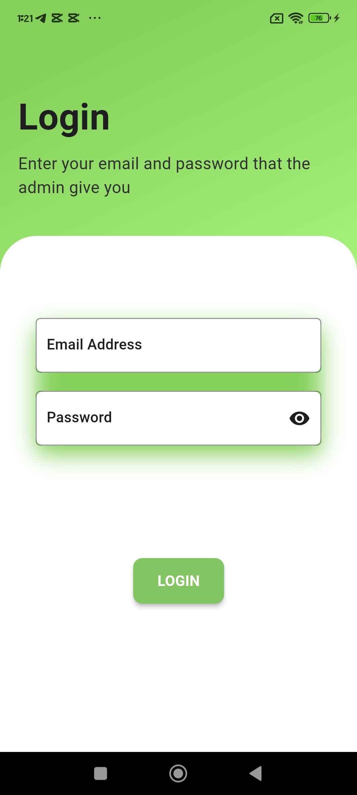
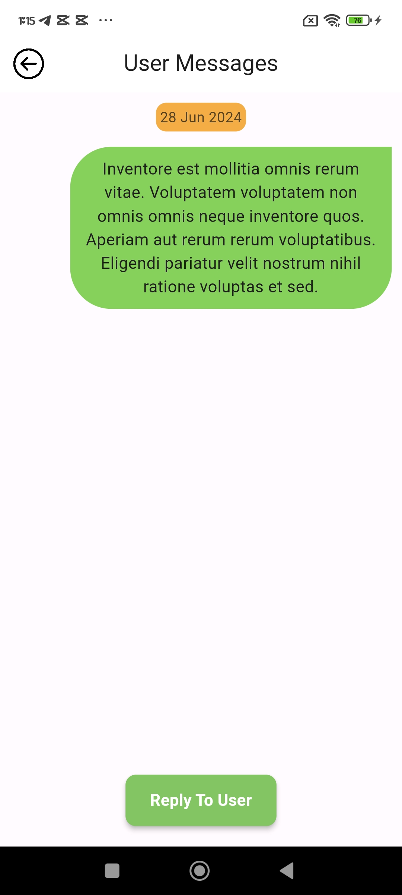
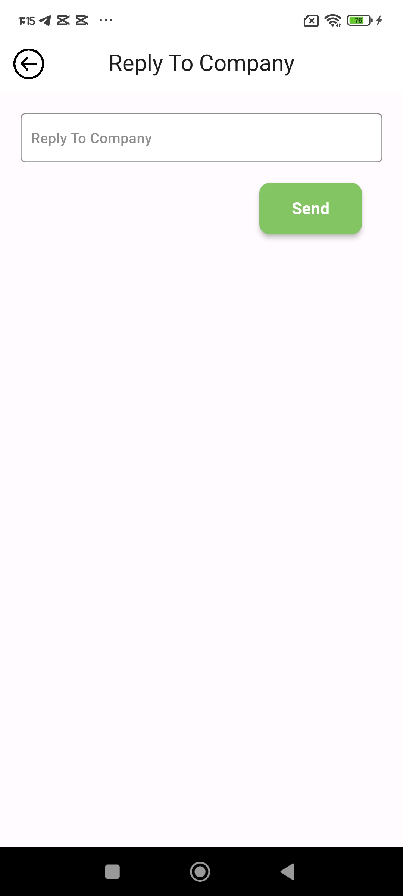
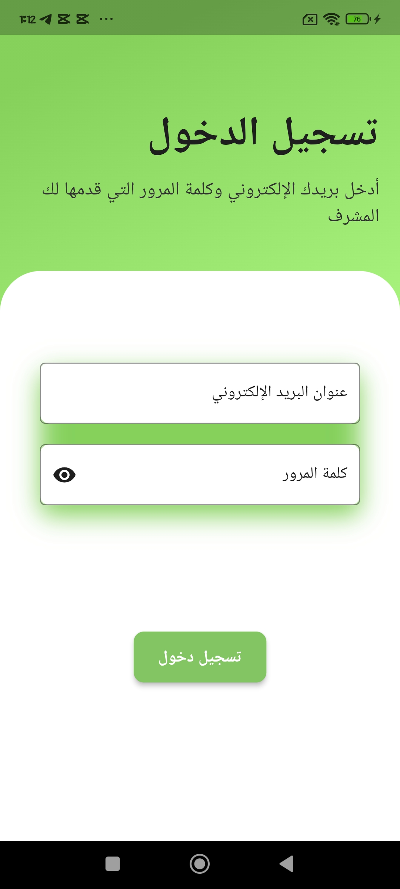
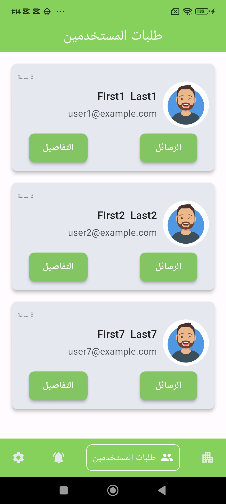
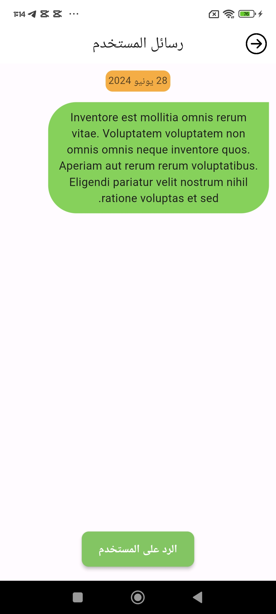
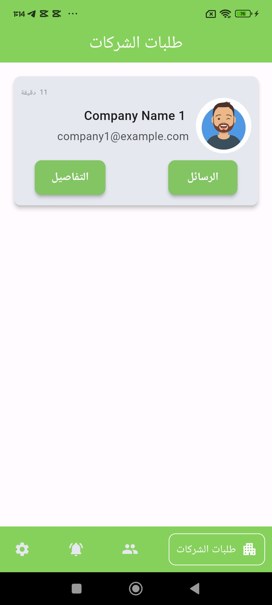
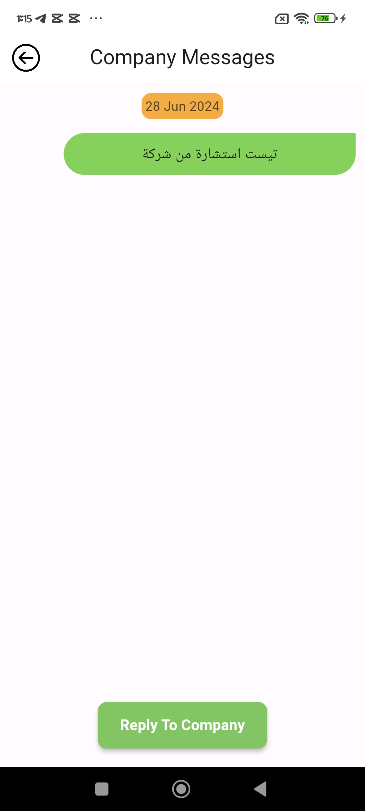
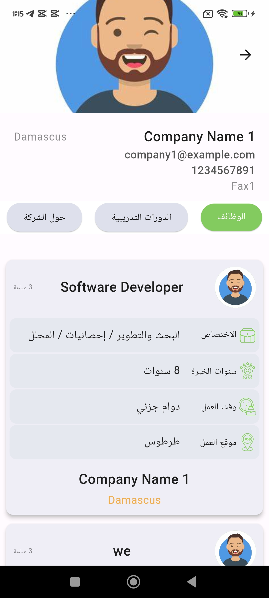

# Tazur-Advisor-App-
The Taazur Advisor App is a platform designed for professional advisors to provide guidance and advice to users and companies. Advisors can log in using credentials provided by the admin and interact with users, offering professional insights and consultations.

## Features
- **Advisor Login:** Secure login with credentials provided by the admin.
- **Provide Advice:** Advisors can offer advice and consultations to users and companies.
- **User Interaction:** Communicate directly with users and companies seeking professional advice.
- **Multi Languages:** Create the app with two languages (English & Arabic).

## Technologies Used
- **Flutter:** For building the mobile app.
- **RESTful APIs:** For server-side interactions.
- **Dart:** The programming language used for Flutter.
- **Get State Managment**

  

  
  
  

  
  
  

**Arabic Screens**

  

  
  

  
  
 

